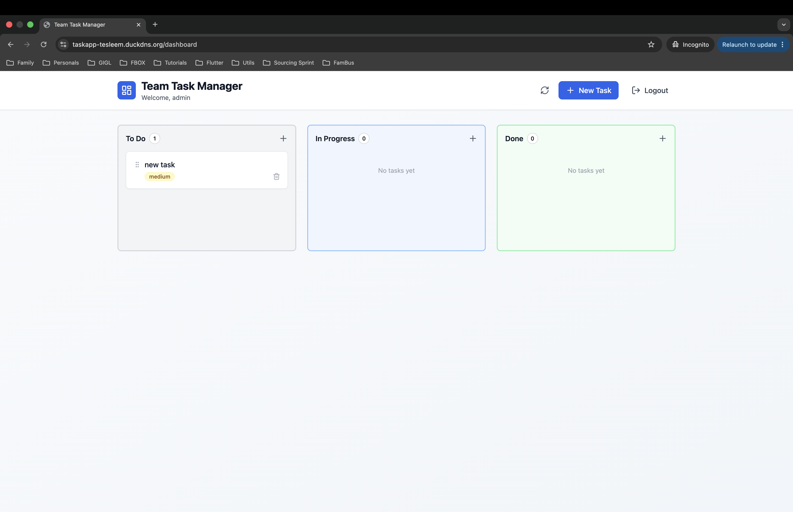

# Capstone Phoenix — TaskApp on Real Kubernetes

This repository provisions and deploys TaskApp on a real multi-node Kubernetes cluster.

## Locked project choices

- Cloud: AWS
- Region: `eu-west-1`
- Cluster: k3s
- Nodes: 1 control-plane + 2 workers
- Domain: `taskapp-tesleem.duckdns.org`
- TLS: cert-manager + Let's Encrypt HTTP-01
- Ingress: ingress-nginx installed with Helm
- GitOps: Argo CD
- Backend image: `ghcr.io/ts-a-devops/taskapp-backend:5d6b8fc`
- Frontend image: `ghcr.io/ts-a-devops/taskapp-frontend:26da2b0`

## Structure

```text
infra/terraform/       AWS VPC, security group, EC2 nodes, remote state
infra/ansible/         hardening, k3s server, k3s worker join
platform/              Helm values and cert-manager issuers
manifests/taskapp/     Kustomize app manifests
scripts/               local helper scripts
gitops/                Argo CD Application
docs/                  architecture, runbook, cost, evidence
```

## Evidence

The screenshot below proves the reachability of the TaskApp website.



## Start here

Follow `docs/RUNBOOK.md` from top to bottom.
